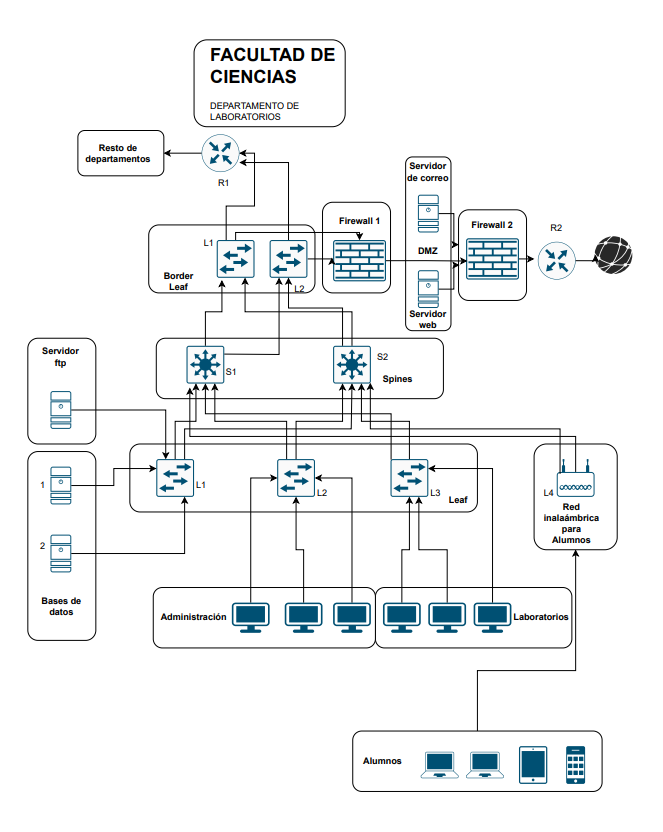
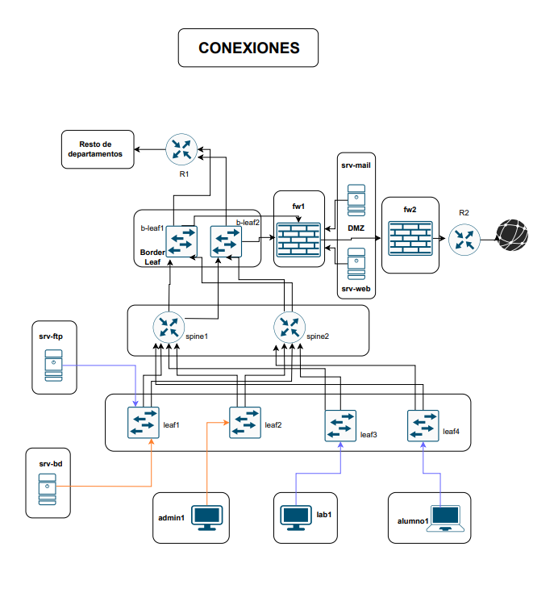

# facultad_ciencias
# Topología de la Facultad de Ciencias 

# Descripcion de la topología

En esta topología tendremos varios tipos de usuarios bien diferenciados. 

## Administración

El personal de administración tendrá acceso a los servidores de base de datos pero no podrá acceder al servidor FTP ni al resto de departamentos. Además podrá acceder a la zona desmilitarizada (DMZ) e internet.

## Laboratorios

Los usuarios ubicados en los laboratorios podrán acceder al servidor FTP, a la DMZ y a internet, pero no tendrán acceso a los servidores de base de datos ni al resto de departamentos.

## Alumnos

Los alumnos tendrán acceso inalámbrico a la red y podrán acceder al servidor FTP, a la DMZ y a internet, pero no podrán acceder a los servidores de base de datos ni al resto de departamentos.

# Dispositivos

La topología se basa en un topología "leafs and spines" con un Border Leaf y una zona DMZ con dos firewall.

Tenemos tres leafs y un punto de acceso inalámbrico que conectarán a los dispositivos finales. Los leafs se conectan de forma redundante con dos spines (switches de capa 3) que a su vez se conectan a dos border leaf para evitar tener un punto único de falla. Esta topología es muy útil ya que es redundante y fácilmente escalable (se añaden leafs sin modificar el core de la topología). 

La DMZ (o zona desmilitarizada) actúa como una nueva capa de seguridad impidiendo que atacantes externos puedan entrar dentro de la organización. Tiene la estructura clásica con dos firewall, uno más cerca de la LAN, con reglas mucho más estrictas para la entrada dentro de la organización, y otro más cerca de internet con una políticas de seguridad menos restrictivas. El monitoreo de la DMZ nos ayudará a descubrir ataques y estar preparados ante intentos de acceso no autorizados.

Por último tendremos un router que conecta con el resto de departamentos de la Facultad.

# Excepciones de la topología

Para implementar la topología en ContainerLab la vamos a "aligerar" para que pueda funcionar correctamente y el ordenador sea capaz de mover la topología sin problema. 

Primero sólo pondremos un host en cada leaf. Utilizaremos un router en el punto de acceso inalámbrico ya que no tenemos ese dispositivo para ContainerLab. Los spines los cambiaremos por router ya que necesitan muchos recursos muchos recursos para funcionar. 

# Configuracion de cada dispositivo 

LEAF1
VLANs: Crea VLAN 10 (Administración) y VLAN 20 (Estudiantes).

SVI: Configura interfaces VLAN10 y VLAN20 con direcciones IP, permitiendo enrutamiento entre VLANs.

Puertos de acceso:

Ethernet0/1 conectado a un servidor de base de datos en VLAN 10.

Ethernet0/2 conectado a un servidor FTP en VLAN 20.

Enlaces troncales ruteados: Hacia Spine1 y Spine2 con IPs de la red 192.168.x.x.

OSPF: Activa OSPF para distribuir rutas en las redes internas y enlaces troncales. ID del router: 1.1.1.1.

🟢 Rol: Actúa como punto de acceso para servicios (BD y FTP), conecta las VLANs a la red general y participa en el enrutamiento dinámico.

LEAF2
VLANs: Igual que leaf1 (ADMINISTRACIÓN y ESTUDIANTES).

SVI: Interfaces VLAN10 y VLAN20 con IPs.

Puerto de acceso:

Ethernet0/1 conectado a un PC de administración (VLAN 10).

Enlaces ruteados: Hacia Spine1 (Ethernet0/2) y Spine2 (Ethernet0/3).

OSPF: Incluye las VLANs y enlaces troncales. ID del router: 2.2.2.2.

🟢 Rol: Brinda conectividad a un host administrativo, integra sus VLANs a la red troncal y publica sus rutas con OSPF.

LEAF3

VLANs: Crea las VLAN 10 y 20, pero solo configura SVI para VLAN 20.

Puerto de acceso:

Ethernet0/1 conectado a un laboratorio (VLAN 20).

Enlaces ruteados: Ethernet0/2 a Spine1 y Ethernet0/3 a Spine2.

OSPF: Publica su red de estudiantes y los enlaces ruteados. ID del router: 3.3.3.3.

🟢 Rol: Conecta un laboratorio para estudiantes a la red general, participa en OSPF con rutas de VLAN 20 y enlaces a los spines.

LEAF4

VLANs: Igual que los demás (10 y 20), pero solo usa VLAN 20.

SVI: Configura IP para VLAN 20.

Puerto de acceso:

Ethernet0/1 conectado a un PC de alumnos (VLAN 20).

Enlaces ruteados: Ethernet0/2 a Spine1 y Ethernet0/3 a Spine2.

OSPF: Publica solo la red de estudiantes (VLAN 20) y sus enlaces. ID del router: 4.4.4.4.

🟢 Rol: Conecta un equipo de estudiantes, anuncia su red mediante OSPF y se integra a la malla de la red Leaf-Spine.

🔥Firewall 1
Tenemos 3 interfaces activas con IPs en la red 10.10.50.0/27:

Ethernet0/1: 10.10.50.1

Ethernet0/2: 10.10.50.2

Ethernet0/3: 10.10.50.3

También tiene una interfaz encendida (Ethernet1/0) sin dirección IP.

Esta configuración sugiere que está pensado para conectar distintas zonas internas o perimetrales (por ejemplo, DMZ, red de usuarios, red de servidores).

No hay configuraciones de rutas ni políticas mostradas (ni estáticas ni dinámicas).

🔥Firewall 2
Tenemos 2 interfaces activas en la red 192.168.4.0/30:

Ethernet0/1: 192.168.4.2

Ethernet0/2: 192.168.4.1

Esta red parece ser un enlace punto a punto, posiblemente entre el Firewall2 y algún router de borde o ISP.

Al igual que Firewall 1, no hay rutas ni políticas configuradas.

Configuración de Leaf B1 y B2

🔧 Interfaces de conexión a Spines:
Leaf B1

Eth0/1 → Spine S1: IP 192.168.1.18/30

Eth0/2 → Spine S2: IP 192.168.2.18/30

Leaf B2

Eth0/1 → Spine S1: IP 192.168.1.22/30

Eth0/2 → Spine S2: IP 192.168.2.22/30

👉 Esto asegura conectividad redundante al núcleo Spine.

🔧 Interfaces hacia el firewall:
Leaf B1

Eth1/0 → Firewall 1: IP 192.168.8.1/30

Leaf B2

Eth0/3 → Firewall 1: IP 192.168.7.2/30

👉 Estas conexiones permiten controlar el tráfico entrante y saliente mediante el firewall.

🔧 Interfaces hacia el Router R1 (departamentos):
Leaf B1

Eth0/3 → R1: IP 192.168.3.1/30

Leaf B2

Eth1/0 → R1: IP 192.168.6.1/30

👉 Esto conecta el datacenter con redes corporativas o de usuarios internos.

⚙️ Configuraciones comunes:
Todas las interfaces están en modo "no switchport", es decir, trabajan en modo L3 (enrutamiento).

Las interfaces están activadas con no shutdown.

Todas tienen una dirección IP /30, lo que indica enlaces punto a punto.

Spine1:

Configura varias interfaces Ethernet como enlaces ruteados hacia los switches Leaf, deshabilitando el modo switchport para usar IPs directas.

Interfaces configuradas con IPs en subredes /30 (255.255.255.252), conectadas a diferentes Leafs y enlaces spine.

Interfaz Ethernet0/1 específicamente conectada a Leaf1.

Enrutamiento dinámico configurado con OSPF:

Router ID: 5.5.5.5

Red anunciada: 192.168.1.0/24 en área 0

Configuración guardada.

Spine2:

Similar a Spine1, con interfaces Ethernet configuradas en modo ruteado (no switchport) hacia Leafs y otros dispositivos según topología.

IPs asignadas en subredes /30 distintas (192.168.2.x).

Router ID para OSPF: 6.6.6.6

OSPF anuncia la red 192.168.2.0/24 en área 0.

Configuración guardada.

Ambos switches Spine actúan como routers para el tráfico entre Leafs, usando OSPF para la convergencia y el intercambio de rutas en el área 0, con interfaces punto a punto en enlaces directos y con IPs estáticas asignadas.

R1 (Router Border Leaf):

Interfaces configuradas:

Ethernet0/1: Enlace a Border Leaf L1 con IP 192.168.3.2/30

Ethernet0/2: Enlace a Border Leaf L2 con IP 192.168.6.2/30

Ethernet0/3: Sin IP asignada, pero activada (posiblemente para uso futuro o como interfaz de switch)

Todas las interfaces están activadas (no shutdown).

Router orientado a conectar Leafs fronterizos (borders).

R2 (Router Gateway):

Interfaces configuradas:

Ethernet0/1: IP 192.168.4.2/30, enlace local posiblemente a otro dispositivo de red.

Ethernet0/2: IP pública o de red externa 102.20.13.230/24.

Ruta estática configurada:

Ruta por defecto (0.0.0.0/0) apunta a 192.168.4.1, encaminando todo el tráfico desconocido hacia esa IP.

Interfaces activadas.

Funcionalidad general:
    R1 se encarga de la interconexión interna entre Leafs fronterizos, con enlaces punto a punto.

    R2 actúa como gateway o router hacia redes externas, con una ruta por defecto para el tráfico saliente hacia la red 192.168.4.1.

Servidor Base de datos
servidor ftp
servidor mail
servidor web

Host admin1
host alumno1
host lab1

